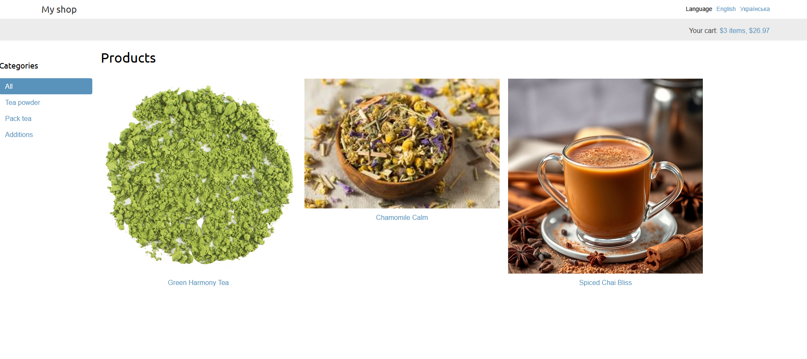
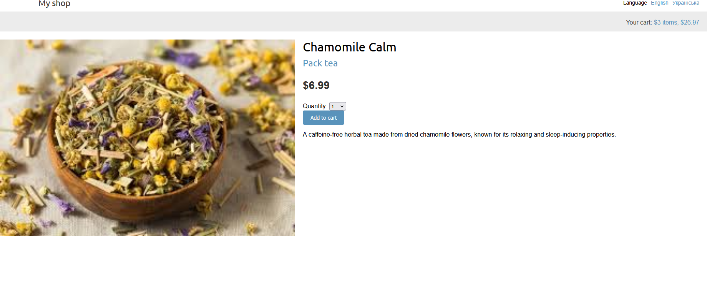
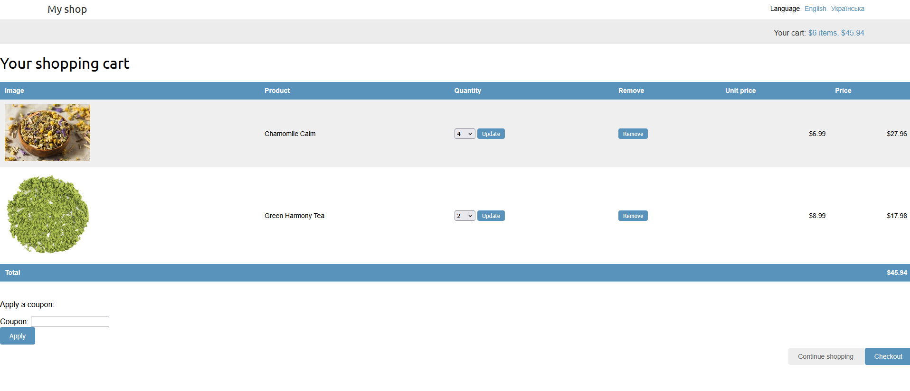

# 🛒 Django E-Commerce Project

An advanced e-commerce website built with Django, featuring Stripe payments, Redis, multilingual support, Celery-based email handling, and a cart and coupon system. Additionally, the project supports generating PDF invoices using WeasyPrint.

## 🚀 Features

- ✅ **Product Management** (List, Detail, Categories)


- ✅ **Shopping Cart** (Add, Remove, Update Items)

- ✅ **Coupons & Discounts**
- ✅ **Stripe Payments Integration** 💳

- ✅ **Order Processing & Invoicing (PDF Generation)** 🧾
- ✅ **Celery & SMTP for Email Notifications** 📧
- ✅ **Multi-language Support** 🌍
- ✅ **PostgreSQL Database** 🐘

---

## 🛠 Tech Stack

- **Backend:** Django, Celery, Redis, PostgreSQL
- **Frontend:** Django Templates, HTML, CSS, JavaScript
- **Payments:** Stripe
- **PDF Generation:** WeasyPrint

---

## 📦 Installation & Setup

### 1. Create & Activate Virtual Environment
```bash
python -m venv venv
source venv/bin/activate  # On Windows use `venv\Scripts\activate`
```

### 2. Install Dependencies
```bash
pip install -r requirements.txt
```

### 3. Configure Environment Variables
Create a `.env` file and set your environment variables (example: `.env.example`)

### 4. Setup PostgreSQL database and Redis

### 5. Run Migrations, Load mock data, Create Superuser
```bash
python manage.py migrate
python manage.py loaddata fixtures/db.json
python manage.py createsuperuser
```

### 6. Run the Development Server
```bash
python manage.py runserver
```

---

## 💳 Payment Processing with Stripe
This project uses Stripe for payment processing. Ensure you have a Stripe account and API keys configured in your `.env` file.

---

## 📄 Generating Invoices (PDF)
Invoices are automatically generated using WeasyPrint when an order is completed.
---

## 📧 Email Notifications
This project uses Celery and SMTP for sending order confirmation emails. Ensure your SMTP credentials are correctly set in the `.env` file.